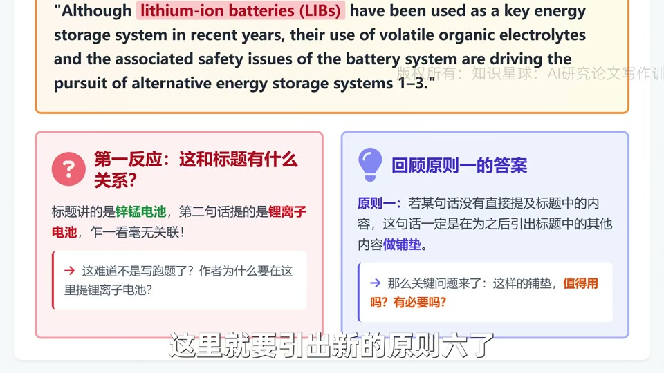

# 【第一期第2次训练讲解】前言过渡的艺术与四大进阶排雷原则

这节课的重点，不是继续讲“上位概念”本身，而是讲前言第二、三、四句怎么过渡，怎样既把读者带进来，又不给自己挖坑。

## 本集核心结论

- 不是所有铺垫都值得写。只要一句话和标题不直接相关，就必须证明它“写了比不写更好”。
- 好的铺垫要建立在读者视角上，用读者熟悉的对象帮助他们理解你真正想讲的那个小众对象。
- 对别人的缺点、局限、问题做比较时，必须客观、克制、有证据，不能带攻击性。
- “很多”“主流”“关键”“普遍”这类词，最好都经过半定量审查，否则极易被反驳。

## 详细拆解

### 1. 为什么标题写锌锰电池，第二句却先讲锂离子电池

图：这句话表面看和标题无关，但它承担的是“把读者熟悉的对象转成后文铺垫”的功能。

- 这节课先回答一个关键疑问：范文标题讲的是锌锰电池，为什么第二句话却去谈锂离子电池。
- 视频给出的答案是原则六：如果一句话不是直接讲标题里的东西，那它必须承担明确的铺垫价值，而且这个价值要大于它拖慢进入正题的副作用。
- 换句话说，铺垫不是“多写一点显得丰富”，而是“只有在显著提升理解和认同时才值得存在”。

### 2. 原则七：从读者熟悉的对象，自然引到你的小众对象

图：先让读者想到他们熟悉的主流体系，再顺势引出“那有没有别的储能体系”，这就是有效铺垫。

- 读者看到“电池”时，脑海里最先冒出的通常不是水系锌锰电池，而是锂离子电池。
- 所以范文先借锂电池这个大家熟悉的对象，建立认知抓手，再把讨论推向“替代储能体系”，最后引出水系可充放电池。
- 这就是原则七的本质：写作不是按作者脑内知识展开，而是按读者能否顺畅跟上的路径展开。

### 3. 原则八和原则九：批评别人时，要克制，也要经得起比例检验

图：像“主流”“大量”“关键”这样的词，只有在占比足够高时才安全，否则一句话就可能被审稿人推翻。

- 原则八强调：只要涉及比较，尤其是指出别的体系有缺点时，就必须确保表述客观、事实充分、措辞委婉。
- 视频特别提醒，不要轻易写“替代锂电池”这种攻击性很强的话。你一旦这么写，就等于把大量锂电研究者一起得罪了。
- 原则九则更进一步：凡是可以引入比例感、数量感的描述，都要做半定量判断。你说“主流”“普遍”，最好真的接近大多数，而不是只占两三成。

### 4. 篇幅分配本身，也是在体现写作判断

图：越宏观、越熟悉的概念，通常越不需要占很多篇幅；越具体、越陌生的概念，越值得多写一句。

- 视频最后把一个非常实用的判断讲清楚了：不同层级的概念，本来就不该平均分配句子。
- 大家都知道的上位概念，一句话立住即可；相对小众但又必须理解的概念，才值得用两句甚至更多展开。
- 这其实也是原则三的延伸版：不是只看“写了几层上位概念”，还要看“每一层用了多少篇幅”。

## 可直接套用的写作检查表

- 只要一句话不直接对应标题，就问自己：不写它会怎样，写它带来的收益是否足以抵消拖慢节奏的代价。
- 先想读者最熟悉的对象是什么，再决定是否需要借它作为过渡桥梁。
- 批评别人时，优先描述你自己工作真正处理的那个维度，别去批和你研究无关的缺点。
- 审查所有“大量、主流、关键、普遍、核心”之类的词，看它们是否站得住。
- 根据概念熟悉度分配篇幅，不要把大同行都知道的东西写成一整段。
