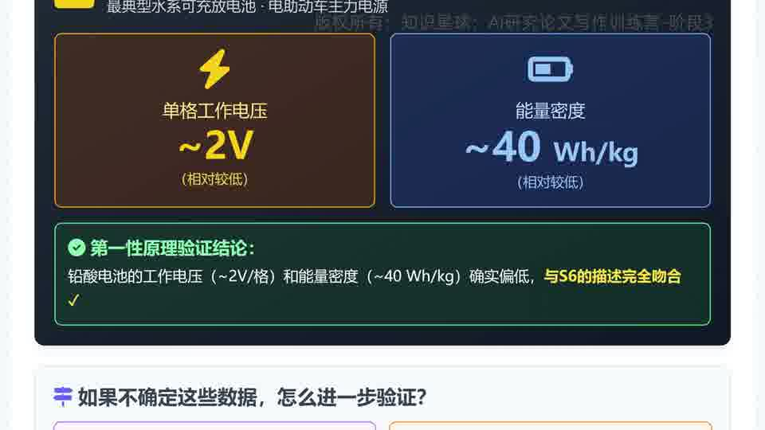

# 【第一期第3次训练讲解】真实世界的第一性原理与避免前后打脸

这节课把问题从“怎么铺垫”推进到“怎么判断一句话是不是站得住”。重点不只是写作技巧，而是研究判断力本身。

## 本集核心结论

- 在前言里写领域痛点、技术缺陷、已有问题时，不能只会引用文献原话，还要回到真实世界做第一性原理判断。
- 文献可以当支撑，但不能当脑子。你得先确认一句话在真实世界中是否说得通。
- 当前面夸了一个体系的优点，后面再说它的问题时，不能直接冲突；优点和缺点必须落在不同维度上。
- 如果文献之间在相近条件下给出矛盾结论，这通常不是写作麻烦，而是潜在选题机会。

## 详细拆解

### 1. “However”之后，不是随便批评，而是有分寸地指出挑战

- 第五句话开始用 `However` 转向问题段，意味着前言从“铺垫价值”进入“点明痛点”。
- 视频反复强调，指出问题时最好用“challenges”这类克制表达，而不是“严重缺陷”“致命不足”这种容易激怒同行的说法。
- 这里的关键不是显得尖锐，而是显得可信。你越克制，反而越不容易被抓话柄。

### 2. 原则十：真实世界的第一性原理思考

图：原则十的核心不是背更多文献，而是学会把一句学术表述拿回真实世界验证。

- 视频把原则十定义得很明确：面对一个技术判断，尤其是优缺点评价，不能因为文献这么写，你就机械地跟着这么写。
- 更稳的做法是回到真实世界看：这个说法是否符合基本常识、真实应用和客观约束。
- 这不是只服务论文写作，而是贯穿整个研究生涯的基本能力。你会不会做判断，决定了你能不能驾驭 AI 生成的文本和别人给你的素材。

### 3. 不确定时怎么验证：先看真实系统，再看权威支撑

图：像铅酸电池这种真实存在、广泛应用的体系，本身就是判断“低电压、低能量密度”这类说法是否可靠的证据入口。

图：如果第一性原理无法直接判断，再去找综述、教材、高引文献，而不是随手抓几篇零散论文。

- 视频给了一个很实用的顺序：先找真实世界里典型、成熟、已经广泛使用的系统做判断，再决定一句话是否合理。
- 如果真实世界无法直接判断，或者问题本身高度专业，那就用高可信度文献兜底，比如权威综述、经典教材、高引论文。
- 这里的逻辑不是“只要有文献就安全”，而是“当你自己难以判断时，至少要把支撑抬到足够权威的层级”。
- 进一步地，如果在相似实验条件下，权威文献之间结论冲突，这往往反而意味着一个值得做的新问题。

### 4. 原则十一：避免前后打脸

图：同一个对象可以同时有优点和缺点，但前提是两者落在不同维度，而不是前面夸完、后面又把同一件事否掉。

- 原则十一讲的是整篇文章的逻辑闭环，不只是某一句话是否顺。
- 你前面如果说某体系安全、低成本，后面再指出它的问题，就必须明确问题落在哪个维度，比如电压、循环、效率、应用场景，而不是直接把前面的话推翻。
- 视频的落点很清楚：你必须时刻知道自己的工作到底解决了什么，再围绕这个核心去组织优点、缺点和问题陈述。

## 可直接套用的写作检查表

- 每写一句“某体系存在问题”，都先问自己：这是文献复读，还是我自己也能说明白为什么成立。
- 先找真实系统验证，再找权威综述、教材或高引文献做支撑。
- 如果文献之间互相打架，不要急着回避，先判断这是不是一个真实的研究空白。
- 检查前文的优点表述和后文的问题表述是否落在不同维度。
- 前言里抛出的每个问题，都要能在后文工作中被回应，否则不要轻易写进去。
