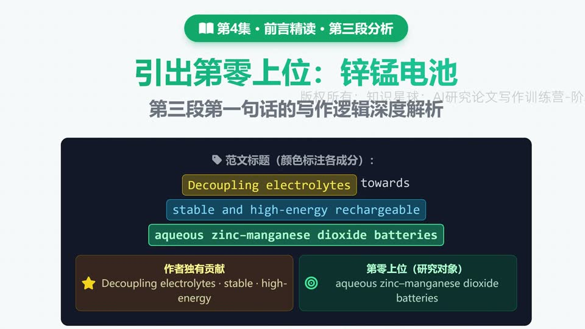
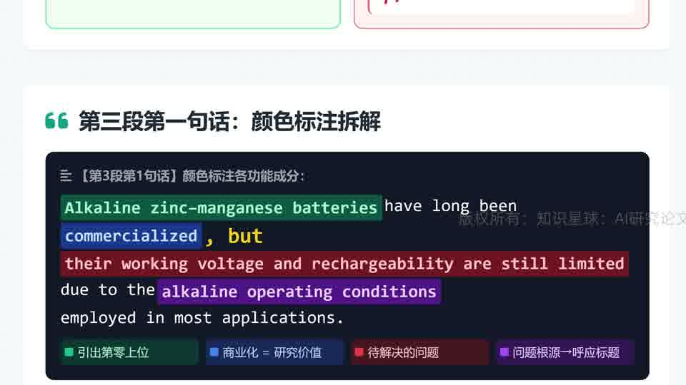
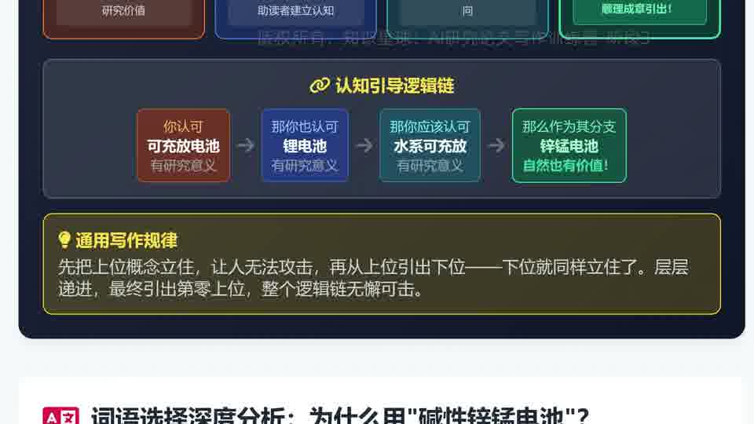
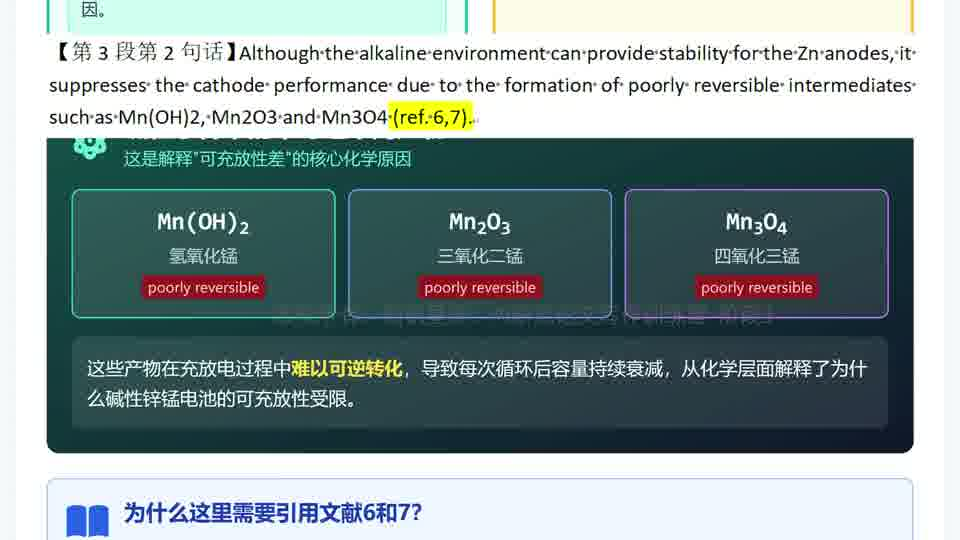

# 【第一期第4次训练讲解】巧妙引出第零上位、相邻领域铺垫与“字字有关联”

这节课真正讲清楚了第三段的任务：前两段已经把上位概念和第二上位铺好了，第三段第一句为什么能稳稳落到“第零上位”，以及它落下去之后，后面为什么能顺势引出作者自己的创新。

## 本集核心结论

- 第零上位一旦出场，标题里属于研究对象的词就必须被处理到，不能挂在标题上却在前言里消失。
- 引出第零上位，不是为了“终于说到研究对象了”，而是为了给后面引出作者独有贡献做最后一层铺垫。
- 相邻领域、熟悉案例、商业化背景，都不是闲笔，它们的作用是帮读者承认“这个对象值得研究”。
- 原则五在这里进一步升级为一句话：你前面提的问题，后面必须由本文工作来接住。

## 详细拆解

### 1. 第零上位为什么一定要在这里出现

图：第三段第一句第一次落到“锌锰电池”这一层，标志着前言从上位铺垫正式收拢到研究对象。

- 视频明确指出，第三段第一句就是把标题里的第零上位真正引出来。
- 这里的关键不是“终于提到了锌锰电池”这么简单，而是告诉你：当前言已经完成更高层概念的铺垫后，必须有一个节点把研究对象落地。
- 如果标题里写了研究对象，但前言始终不处理它，读者自然会觉得标题和正文没有对上。

### 2. 第三段第一句其实承担了四个功能

图：同一句话里同时承担“引出第零上位、交代研究价值、指出待解决问题、埋下标题呼应点”四个任务。

- 这节课把第三段第一句拆得很细：它不仅提到了第零上位，还顺手说明这个体系为什么值得研究，以及它目前卡在哪里。
- 这类句子的厉害之处就在于高度压缩。它不是一句话只做一件事，而是多个逻辑功能同时服务同一个目标。
- 你以后读范文时，不能只看“这句在讲什么内容”，还要看“这句在整个逻辑链里承担了几层功能”。

### 3. 先把上位概念立住，再让第零上位顺势成立

图：先让读者认可上位概念，再从上位概念引出下位对象，最后第零上位就不再突兀。

- 视频把这条链讲得很清楚：先让读者认可“可充放电池值得研究”，再认可“水系可充放电池值得研究”，最后引到“锌锰电池也是有价值的一支”。
- 因为前面的上位概念已经站稳，所以第零上位不是硬拐进来，而是顺着认知链自然收束。
- 这也是为什么会用到锂电池、铅酸电池、碱性锌锰电池这类相邻领域或熟悉案例。它们的价值不是喧宾夺主，而是帮你减少读者的抵触和陌生感。

### 4. 前面提到的问题，必须正好是你后面能解决的问题

图：这里不仅指出问题，还顺带给出机制层解释，并通过文献支撑让问题陈述更站得住。

- 这一讲反复提醒，前面提到的低电压、可充放性受限等问题，必须是后文工作真正能改善的东西。
- 如果你前面列了一堆行业痛点，后面结果一个都没碰到，那不是“写得丰富”，而是逻辑塌了。
- 所以视频把原则五再次收紧为“字字有关联”：不仅词面要相关，问题、原因、后文方案之间也要形成一条可追踪的逻辑线。

## 可直接套用的写作检查表

- 检查标题中的研究对象词组是否在前言某个关键节点被明确处理到。
- 判断第三段第一句是否同时承担了“对象落地、研究价值、问题引出、后文铺垫”这几项功能。
- 使用相邻领域或熟悉案例时，确认它们的作用是帮助读者建立认知，而不是分散主题。
- 写问题时只写你后文能接住、能回应、能解决的那几个。
- 看到机制解释和引用文献时，继续追问一句：它们是不是都在服务标题和本文方案。
