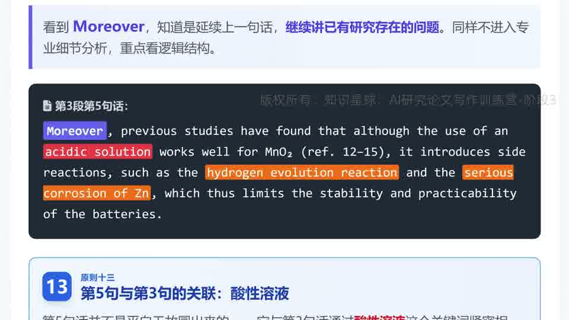

# 【第一期第5次训练讲解】文献点评的 How/Why/So What、引入画面感与逻辑闭环

这节课把很多人最容易写成“流水账”的文献综述部分，压成了一套非常实用的判断框架：你到底是在罗列论文，还是在真正点评文献、推进论证。

## 本集核心结论

- 研究论文里的文献部分，本质上更接近“文献点评”而不是“大而全综述”。
- 一句高质量的文献点评，通常至少要回答三个问题：怎么做的、为什么有效、结果是什么。
- 只说结果不说方法和原因，会让句子显得没头没脑，读者很难真正被说服。
- 所谓“画面感”，不是为了写得花，而是在关键位置加入具体、可感的细节，降低阅读阻力。
- 文献点评不能只把别人工作列出来，还要保证它和后文本文工作形成严密衔接。

## 详细拆解

### 1. 文献点评的完整骨架：How / Why / So What

图：如果一句文献点评只有结果，没有方法和原因，读者很容易马上追问“怎么做到的”“为什么会这样”。

图：How 对应方法路径，Why 对应机制或原因，So What 对应结果或效果，这三部分共同决定一句话是否完整。

- 视频把第三句文献点评拆成三部分：How 是怎么做到，Why 是为什么成立，So What 是最终得到了什么结果。
- 这不是要你机械套公式，而是提醒你：文献点评要让读者一下就抓住研究思路、机理依据和效果输出。
- 很多“综而不述”的句子，问题就出在只留下了 So What，导致读者看完只记得一个泛泛的结论。

### 2. 文献点评不是点名册，而是要做概括和压缩

- 视频特别强调，研究论文里的篇幅有限，所以你不能把“谁做了什么、谁又做了什么”一篇篇排下去。
- 真正好的写法，是先提炼出多篇文献的共性做法、共性发现或共性局限，再在必要时补一个代表性案例。
- 这样读者读到的是“这个方向已经被推进到哪里”，而不是“作者帮我抄了一遍参考文献目录”。

### 3. 原则十二：在必要之处引入画面感

图：把“离子的可逆插入和脱出”具体成几种离子后，读者会更快形成感性印象，也更不容易一眼滑过去。

- 这节课把“画面感”讲得很具体：不是每句话都要画面化，而是在最容易抽象、最容易读过去的地方，补一个具体而形象的细节。
- 比如不只说“离子可逆插入/脱出”，而是给出具体离子名，读者一下就更容易形成脑内图像。
- 这类处理能明显降低阅读障碍，也会让文献点评更容易留下印象。

### 4. 原则十三：后一句必须咬住前一句，问题链要能接到本文方案

图：看到 `Moreover`，就知道这句不是另起炉灶，而是在继续延展前一句已经提出的问题。

图：前文说酸性环境利于 MnO2、碱性环境利于 Zn，看似互相冲突，后文用“解耦”把这对矛盾变成本文工作的入口。

- 第五讲把逻辑闭环讲得更细了。第三句说已有进展，第四句和第五句就要继续沿着同一问题链展开，而不是突然跳走。
- 视频把这种“后一两句必须紧贴前一句或前两句”的写法命名为原则十三，本质是保证文段内部的力线不断掉。
- 更重要的是，文献点评里指出的局限，最后都必须能被本文方案接住。否则你指出的问题越多，只会越显得自己的工作不解决关键矛盾。

## 可直接套用的写作检查表

- 检查每句文献点评是否至少回答了“怎么做、为什么有效、效果如何”中的大部分问题。
- 避免把文献综述写成“谁做了什么”的流水账，优先提炼共性和脉络。
- 在抽象概念最容易让读者走神的地方，补一个具体名词、数字、对象或示意细节。
- 关注连接词，尤其是 `However`、`Moreover` 这类信号词，判断句间是否真正延续同一条问题链。
- 文献点评里抛出的每个局限，都要能对应到本文后面的解决方案或研究亮点。
