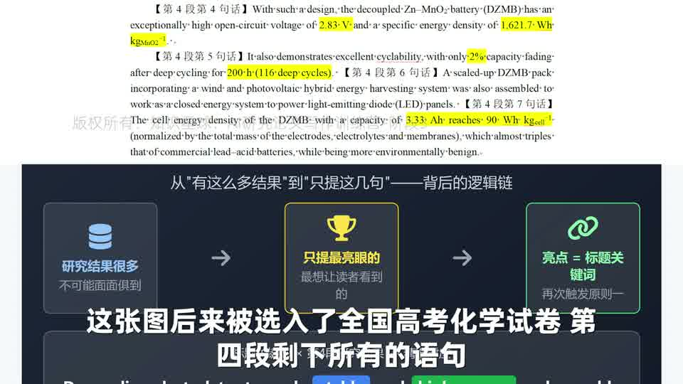

# 【第一期第6次训练讲解】引出本文工作、呼应标题原则与逻辑闭环

这一讲是前面所有铺垫的收口点。前文已经把研究对象、已有进展和剩余问题都布好了，接下来就轮到“本文到底做了什么”正式登场。

## 本集核心结论

- 本文工作不是凭空出现的，而是要顺着前文已经指出的问题自然引出来。
- 标题里真正代表作者独有贡献的关键词，通常会在前言最后一段集中亮相。
- 如果标题里的核心概念很抽象，可以在前言中提前借助示意图建立读者的画面感。
- 前言最后一段不该把所有结果都倒出来，而要只挑最能呼应标题、最能填前文坑的结果。
- 好前言的闭环感，来自“前面挖的坑，后面都有对应结果填上”。

## 详细拆解

### 1. 第四段第一句就是“本文解决思路登场”

图：在第三段完成“已有工作做到哪里、还差什么”之后，第四段第一句顺理成章切换到“本文怎么解决”。

- 视频开头先把逻辑链捋顺：先讲研究对象存在什么问题，再讲别人已经做到什么程度，还剩哪些问题没解决，最后才轮到本文方案出现。
- 这意味着“本文工作”不是单独一块内容，而是前文问题链的必然回应。
- 换句话说，如果你前面的问题铺垫不到位，后面这句“Herein, we...”就会显得突兀甚至像硬插进来。

### 2. 标题关键词为什么直到这里才集中出现

图：`Decoupling` 这类体现作者独有贡献的词，不会太早出现，而是在前言最后段真正切换到本文工作时才亮相。

- 这节课把一个重要规律讲得很透：标题里那些代表作者独有贡献的词，往往不会在背景铺垫阶段频繁出现。
- 因为在那之前，前言的任务是立住研究对象、问题和需求，而不是过早把自己的创新硬塞出来。
- 一旦切到本文工作，这类词就会高密度出现，因为它们本来就属于“真正开始讲我做了什么”的部分。

### 3. 为什么有时前言里要提前插图

图：当核心创新点本身较抽象时，示意图能提前把“解耦”这种概念变成读者可感知的操作画面。

- 视频认为，像 `Decoupling` 这种抽象概念，如果只用一句文字带过去，读者很容易形成模糊理解，甚至误解。
- 所以范文在前言最后一段里直接借图来解释核心创新，这既符合换位思考，也符合原则十二的“在必要处引入画面感”。
- 这里的关键不是“前言一定要有图”，而是“当图能明显降低理解门槛时，提前出现是值得的”。

### 4. 最后一段为什么只挑几条结果说

图：前言最后一段不是结果堆砌，而是只挑最亮眼、最能呼应标题的几条结果。

图：`high-energy` 和 `stable` 都被具体结果精确回填，说明标题不是口号，而是后文结果的浓缩版。

- 视频明确指出，作者当然还有很多结果，但前言最后一段不可能面面俱到，只会挑最能代表论文贡献的结果。
- 选取标准不是“我最喜欢哪条数据”，而是“哪条结果最能直接回应标题和前文埋下的问题”。
- 这里两个最关键的回应是：用具体数据支撑 `high-energy`，用循环衰减数据支撑 `stable`。这就是原则一在前言收口段的再次体现。
- 后面再补放大电池组、实际应用场景、与商业体系对比，作用也是继续把前文提过的应用价值和现实意义补齐。

## 可直接套用的写作检查表

- 在引出本文工作之前，先确认前文已经把“问题是什么、别人做到哪、还差什么”讲清楚。
- 检查标题里最能代表作者独有贡献的词，是否出现在前言最后一段的关键句里。
- 如果创新点很抽象，判断是否值得提前用图、示意图或更形象的描述降低理解门槛。
- 前言最后一段只写最能代表贡献、最能对应标题关键词的结果。
- 逐项回看前文提出的痛点，看最后一段是否真的把它们一一填平。
