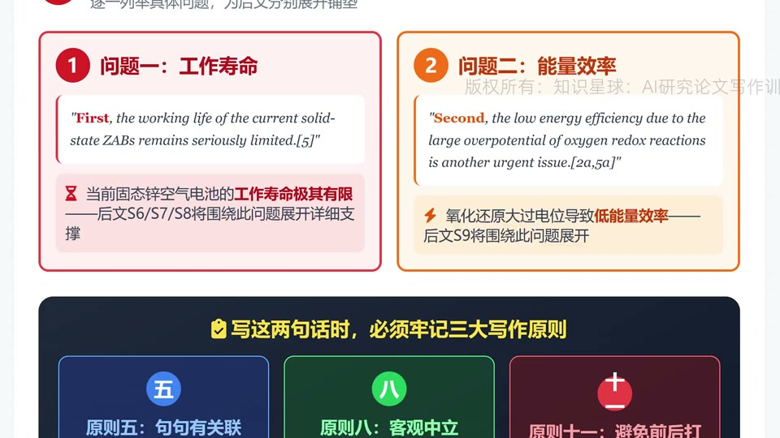
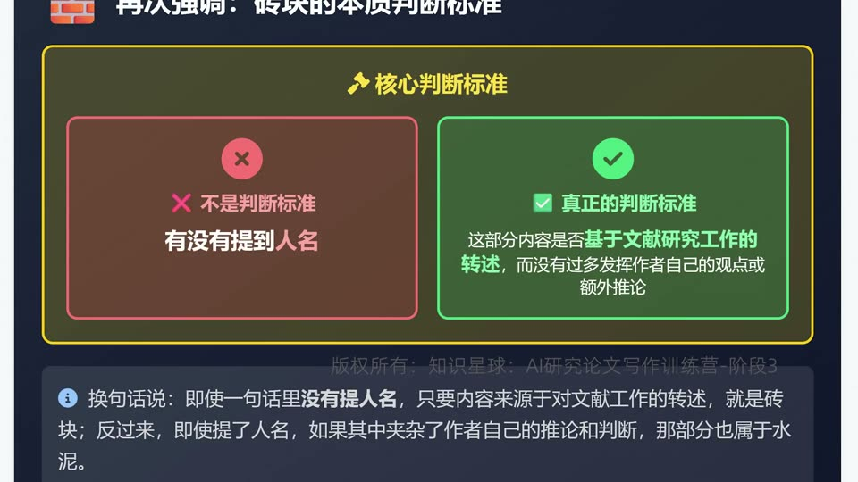
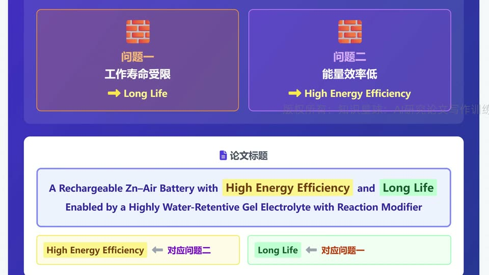
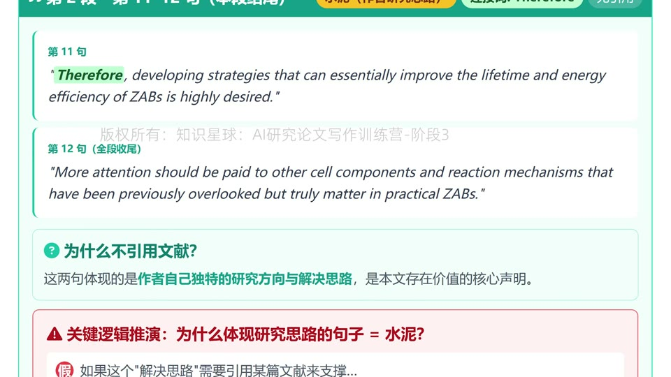

# 【第一期第8次训练讲解】文献点评的总分结构、“水泥与砖块”理论及原则十四

这节课真正解决的是一个高频写作误区：很多人的文献点评看起来“引用很多”，但读起来像流水账；也有些人观点很多，却缺少足够证据。视频给出的答案是，把文献点评理解为一堵墙，它既需要“砖块”，也需要“水泥”，而且两者的比例、位置和服务对象都必须准确。

## 本集最核心的四个结论

- 好的文献点评不是顺着文献一篇篇念过去，而是先总后分、分里再套总分的嵌套结构。
- “砖块”是基于文献事实、数据、结论的直接转述；“水泥”是作者的概括、推论、第一性原理解释、连接词和研究思路。
- 判断一句话是不是砖块，不看有没有提人名，而看它是否主要是在转述文献已有内容；判断是不是水泥，要看作者有没有加入自己的概括和推演。
- 原则十四的本质不是“多引文献”或“多写观点”，而是让砖块定向服务标题中的核心问题，再用足够的水泥把它们粘成完整论证链。

## 1. 文献点评先总后分，而且常常是“总分里再套总分”

图：这张图把第二段的总起抓得很清楚，作者先总括出两个问题，再分别展开支撑。

- 这段范文不是一上来就点评某篇文献，而是先总括出两个核心问题：工作寿命受限、能量效率低。
- 这个“总”非常关键，因为它决定后面所有文献材料该往哪里放，也决定读者要用什么框架理解后续细节。
- 后面第 6 到第 8 句，集中展开第一个问题；第 9 到第 12 句，再集中展开第二个问题。
- 更重要的是，视频指出这里不是简单总分，而是“总分嵌套”。例如先总说“大部分已有研究的思路为何不足”，再在其中继续分成寿命问题和能效问题两条支线。
- 这就是为什么好文献点评读起来会有明显骨架感，而不是材料堆积感。

## 2. 好的“分”不是平铺材料，而是先抽象判断，再给例子和证据落地

图：`however` 先提出总体不足，紧接着用 `for example` 给出具体数据和事实支撑，这是典型的“抽象判断 + 证据落地”。

- 视频特别强调一句很实用的写法：先用一句高度概括的话指出已有研究的共同不足，再紧接着给具体例子、数据或事实支撑。
- 这样写有两个好处。
- 第一，读者先知道你想证明什么，再去看证据，不会迷失在材料里。
- 第二，你在指出别人工作存在不足时，不是空口下判断，而是马上拿出可以落地的事实。
- 同时，这种写法也符合原则八和原则十一：表述要客观，不要把“已有研究无效”写得像情绪化攻击；而且前面刚肯定领域进展，后面指出局限时不能写成前后互相打脸。
- 所以这里的核心不是信号词本身，而是这些信号词背后的论证秩序：`however` 提出转折，`for example` 负责证据落地，`therefore` 才能顺势引出作者方案。

## 3. 什么是“砖块”，什么是“水泥”

图：视频把一个常见误区讲透了，是否提到某某人不是关键，关键在于这部分内容是不是基于文献结果的直接转述。

- 视频把文献点评中的内容分成两类。
- 砖块：基于文献事实、数据、结论的直接转述。哪怕没有写“某某人做了什么”，只要本质上是在转述文献已有结果，它仍然是砖块。
- 水泥：作者自己提炼出来的概括、从证据进一步推出的结论、基于第一性原理做出的解释、以及承担逻辑连接功能的话语。
- 一个很重要的细节是，引用位置本身也在暴露“哪一半是砖块，哪一半是水泥”。
- 比如某句话前半句是文献给出的寿命数据，后半句是作者根据这个数据得出的进一步结论，那么引用只该跟在前半句后面，而不是把后半句也伪装成文献原话。
- 这也是为什么视频反复强调：不能机械地按“有引用就是砖块、没引用就是水泥”来分。真正标准是，这部分内容有没有超出文献原始结果，进入作者自己的概括和推演。

## 4. 砖块不是随便搬，必须精准服务标题和中心思想

图：范文选择的两类砖块，正好对应标题中的 `High Energy Efficiency` 和 `Long Life`，这就是“定向选砖”。

- 视频里最有价值的一步，不是告诉你“要引用哪些文献”，而是告诉你“为什么选这些文献结果，而不选别的”。
- 这篇标题里最突出的结果是 `High Energy Efficiency` 和 `Long Life`，因此作者在文献点评里挑出来的两大问题，也正好对应能量效率和寿命。
- 这说明砖块的选择不是中性的。
- 同样研究锌空气电池，如果你的论文要解决的是低温工作、柔性稳定性、或者别的痛点，你就该选别的砖块。
- 所以砖块虽然看似只是“转述别人”，但真正难点在于筛选。选错砖块，整段文献点评就会和标题脱节；选对砖块，读者会明显感到标题、问题、已有工作、作者方案是一条连续的逻辑链。

## 5. 为什么作者自己的解决思路一定属于“水泥”

图：`therefore` 引出的不是别人已经证明过的结论，而是作者自己的研究方向，所以这里必须属于水泥。

- 文献点评的最后两句通常最关键，因为它们负责从“已有工作的问题”转向“本文为什么值得做”。
- 这两句之所以是水泥，不是因为它们没有引用，而是因为它们体现的是作者自己的研究方向和解决方案。
- 如果这种“解决思路”还需要靠某篇现成文献来证明，那往往意味着别人已经把这件事做完了，你这篇论文的独立价值就会变弱。
- 所以，好的文献点评并不是以引用结尾，而是以“基于前面证据和推理，作者自然推出本文要走的方向”结尾。
- 这也解释了为什么视频把 `therefore`、`however`、`in addition`、`first`、`second` 这类连接词也纳入水泥范畴：它们负责把砖块组织成作者自己的论证路径。

## 6. 原则十四：水泥和砖块比例必须合适

- 砖块过多，文献点评会变成“综而不述”的流水账。
- 这类文本的问题不是“没做功课”，而是作者没有把材料组织成自己的判断，读者只能自己从杂乱材料里猜作者到底想说什么。
- 水泥过多，则会变成“观点很多、证据不够”，让人怀疑作者是不是在忽略已有工作，或者只是张口就来。
- 原则十四真正要解决的，就是让作者既不沦为文献复读机，也不沦为空泛评论者。
- 最好的状态是：砖块提供可信事实，水泥提供结构、推理和方向；两者合起来，刚好支撑标题中最核心的科学问题与贡献。

## 可直接套用的检查表

- 先写出你的文献点评“总句”，明确本段到底总括了几个核心问题。
- 检查每个“分句”是不是在服务这些总句，而不是从别的维度横向跑偏。
- 凡是引用了文献数据、实验结果、现成结论的内容，优先判断为砖块。
- 凡是作者自己概括出来的共性判断、第一性原理解释、逻辑连接和研究思路，优先判断为水泥。
- 不要用“有没有提某某人”来区分水泥和砖块，这个标准是错的。
- 挑砖块时先看标题和中心思想，优先选那些能直接支撑标题关键词的问题和证据。
- 如果一段话几乎全是别人做了什么，你需要补足水泥；如果一段话几乎全是你自己的判断，你需要补足砖块。
- 遇到“木桶理论”这类写法时，不要照搬话术，先确认你的细分领域里是否真的存在“多数研究都只在加长某一块板”的结构性事实。
